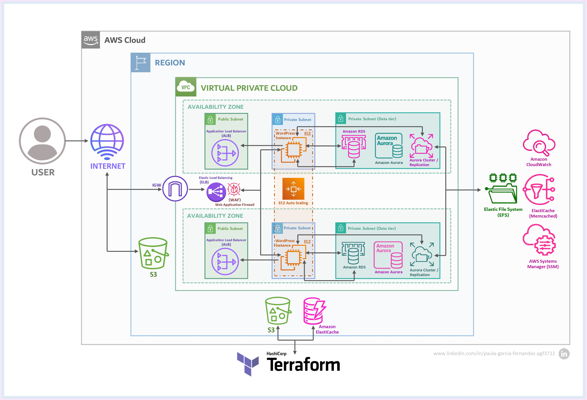

# Cloud Architecture Proposal for a National Healthcare Platform

AWS-based cloud architecture for a scalable, secure, and highly available healthcare platform.

## Overview

This project presents the design of a cloud architecture for **Salud360 Asistencia Integral S.A.**, a fictional healthcare provider operating across multiple regions in Spain. The solution is designed to support sensitive healthcare workloads while addressing **security**, **high availability**, **scalability**, **cost efficiency**, and **regulatory compliance (GDPR)**.

The architecture combines a **current deployed baseline** with a more robust **target production-ready design** based on AWS managed services and Infrastructure as Code principles.

---

## Project Highlights

- **Application Load Balancer (ALB)** for traffic distribution
- **EC2 + Auto Scaling Group** for horizontal scalability
- **Amazon Aurora** for managed relational storage
- **Amazon EFS** for shared application storage
- **Amazon ElastiCache (Memcached)** for performance optimization
- **AWS WAF** for web-layer protection
- **Amazon CloudWatch** for monitoring and observability
- **Terraform-oriented IaC approach** for repeatable deployments

---

## Current Implementation

The current deployed solution represents a simplified but functional baseline:

- **Amazon EC2** running WordPress as the web layer
- **Amazon Aurora MySQL** deployed in a private subnet
- **VPC segmentation** with public and private subnets
- **Security groups** controlling communication between layers

This implementation validates the application and data layers and serves as the foundation for the target architecture.

---

## Target Architecture

The target architecture is designed as a **scalable, highly available, and production-ready AWS environment**.

### Main components
- **ALB** as the public entry point
- **Multiple EC2 instances** behind an **Auto Scaling Group**
- **Amazon Aurora (Multi-AZ)** for durability and failover
- **Amazon EFS** for shared storage across instances
- **Amazon ElastiCache** to reduce database load
- **AWS WAF** for web threat protection
- **CloudWatch** for metrics, logs, and alerts

---

## AWS Well-Architected Alignment

This proposal is aligned with the five AWS Well-Architected pillars:

- **Operational Excellence** — repeatable deployments and operational visibility
- **Security** — VPC isolation, private subnets, encryption, and WAF
- **Reliability** — Multi-AZ design, load balancing, and failover mechanisms
- **Performance Efficiency** — Auto Scaling and caching with ElastiCache
- **Cost Optimization** — managed services and demand-based resource allocation

---

## Security and Compliance

Because the platform is designed for healthcare data, security is treated as a core architectural requirement:

- **GDPR-oriented design**
- **Encryption at rest and in transit**
- **Private database layer**
- **Security groups and controlled access paths**
- **Web protection with AWS WAF**
- **Monitoring and auditing support through CloudWatch**

---

## Scalability and High Availability

The solution is designed to support variable workloads while maintaining resilience:

- **Auto Scaling Group** for compute elasticity
- **Application Load Balancer** for fault-tolerant request distribution
- **Multi-AZ database strategy**
- **Layer separation** between application and data services

---

## Infrastructure as Code

The proposed architecture is designed following **Terraform-based Infrastructure as Code principles**.

The IaC approach focuses on:
- modular infrastructure design
- reusable configuration
- remote state management
- environment parameterization
- automated provisioning of networking, compute, storage, and database resources

> Note: in this repository, Terraform is presented as an architectural and organizational approach rather than as a fully tested production deployment.

---

## Cost Estimation

A baseline monthly cost estimation was defined for a **low-to-moderate traffic scenario**.

### Main cost drivers
- EC2 (baseline compute layer)
- Application Load Balancer
- Amazon Aurora
- Amazon EFS
- Amazon S3
- CloudWatch
- Data transfer

**Estimated baseline cost:** **~60 € / month**

This estimation reflects a **minimal production-ready setup** and does not fully represent a maximum-redundancy deployment.

